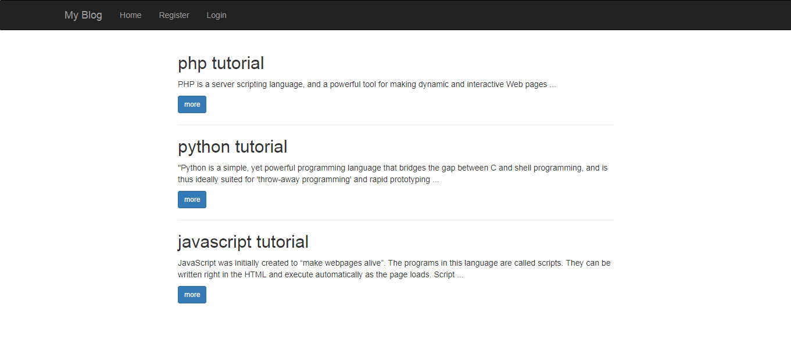
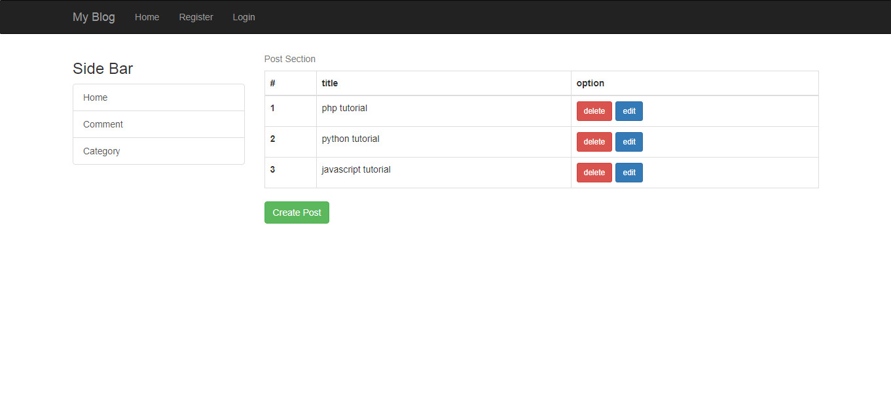

# Node.js CMS
sample Node.js CMS with CRUD

Home page |      Dashboard
-------- | ---
 | 

# Installation

```bash
1- git clone https://faridvatani@bitbucket.org/faridvatani/node.js-cms.git
2- cd Node.jsCMS
3- npm install
4- node app.js
```
